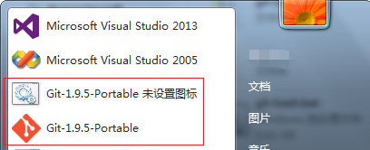
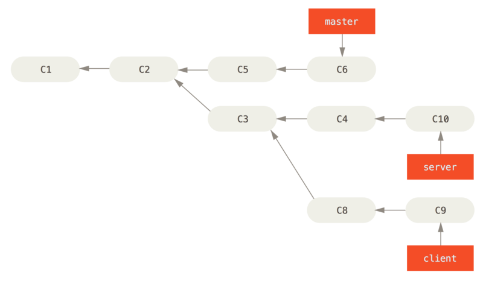
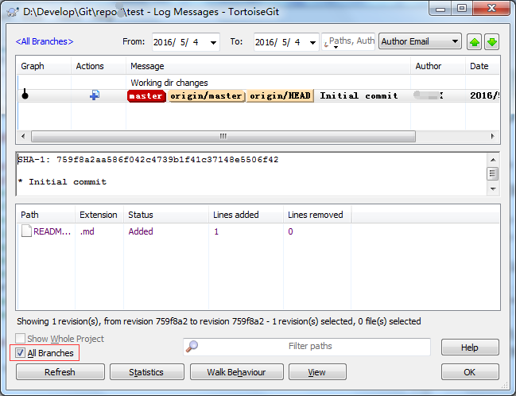
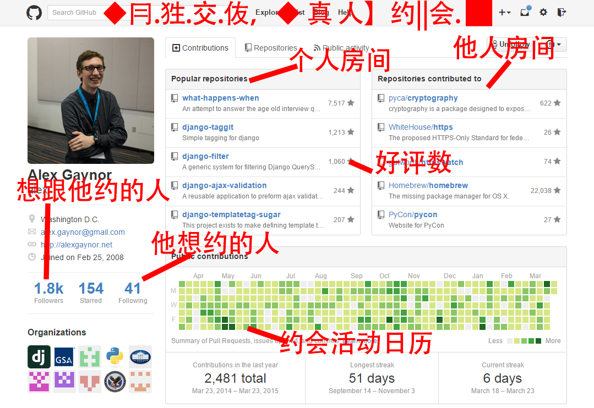

# 学习 git 的日志

------

[TOC]

## Windows 下安装 git-bash

进入 Git [网站](https://git-scm.com/)，页面中选择 [download](https://git-scm.com/download)，进一步选择 [Windows](https://git-scm.com/download/win)，这时，网页将根据的主机系统是 x86 或是 x64 自动下载相应的版本。

除此，也可以在上一网页中自行选择下载其它版本：

> If your download hasn't started, click here to download manually.
> 
> Other Git for Windows downloads
> 
> Git for Windows Setup
> 
> [32-bit Git for Windows Setup]().
> 
> [64-bit Git for Windows Setup]().
> 
> Git for Windows Portable ("thumbdrive edition")
> 
> [32-bit Git for Windows Portable]().
> 
> [64-bit Git for Windows Portable]().

这里，选择 Portable（便携版） 版本，下载后的文件是一个压缩包文件，早起的版本是以 `.7z` 为后缀（如：`PortableGit-1.9.5-preview20150319.7z`），目前，新的版本是以 `.7z.exe` 为后缀（如：`PortableGit-2.8.1-64-bit.7z.exe`），该文件在 Windows 显示的图标是 `7z SFX`，这是一个使用 7-ZIP 自解压模块 `7z SFX`生成的自解压形式的 exe 可执行文件；双击，选择解压目录位置（例如： `D:\Develop\Git\PortableGit-2.8.1-x64\`），在解压生成目录下的 `git-bash.exe` 就是要使用的工具了（备注：可以右击该文件，选择“附加到开始菜单”，将其添加到开始菜单快捷方式中）。

> 早先的版本，解压缩后，目录下是一个批处理的 `git-bash.bat` 文件，当添加到开始菜单快捷方式中后，不能够显示 Git 的 icon 图标；有个技巧：右击 `git-bash.bat` 文件，选择“创建快捷方式”，将生成的快捷方式文件重命名（比如：`PortableGit-1.9.5`），右击该快捷方式文件，选择“属性”，再在 \[快捷方式\] 选项卡中选择“更改图标”按钮，“浏览”选择 “`Git-1.9.5-Portable\etc\git.ico`” 文件；
> 这时，该快捷方式就已经有了 Git 的 icon 图标了，随后将其添加到开始菜单快捷方式中（右击菜单如果没有“添加到开始菜单”，可直接将该文件拖拽到任务栏左下角的开始菜单上悬停几秒，弹出“附到开始菜单”即可释放）。  
> 

## Git 配置

### [初次运行 Git 前的配置](https://git-scm.com/book/zh/v2/%E8%B5%B7%E6%AD%A5-%E5%88%9D%E6%AC%A1%E8%BF%90%E8%A1%8C-Git-%E5%89%8D%E7%9A%84%E9%85%8D%E7%BD%AE)

Git 自带一个 git config 的工具来帮助设置控制 Git 外观和行为的配置变量。 这些变量存储在三个不同的位置：

- `/etc/gitconfig` 文件：包含系统上每一个用户及他们仓库的通用配置。 如果使用带有 --system 选项的 git config 时，它会从此文件读写配置变量。

- `~/.gitconfig` 或 `~/.config/git/config` 文件：只针对当前用户。 可以传递 --global 选项让 Git 读写此文件。

- 当前仓库的 .git 目录中的 config 文件（就是 `.git/config`）：针对该仓库。

每一个级别覆盖上一级别的配置，所以 .git/config 的配置变量会覆盖 /etc/gitconfig 中的配置变量。

在 Windows 系统中，Git 会查找 $HOME 目录下（一般情况下是 C:\Users\$USER）的 .gitconfig 文件。 Git 同样也会寻找 /etc/gitconfig 文件，但只限于 MSys 的根目录下，即安装 Git 时所选的目标位置。

    $ git config --global user.name "John Doe"
    $ git config --global user.email johndoe@example.com

    $ git config --system --list
    core.symlinks=false
    core.autocrlf=true
    color.diff=auto
    color.status=auto
    color.branch=auto
    color.interactive=true
    pack.packsizelimit=2g
    help.format=html
    http.sslcainfo=/ssl/certs/ca-bundle.crt
    diff.astextplain.textconv=astextplain
    rebase.autosquash=true
    filter.lfs.clean=git-lfs clean -- %f
    filter.lfs.smudge=git-lfs smudge -- %f
    filter.lfs.process=git-lfs filter-process
    filter.lfs.required=true
    credential.helper=manager

    $ git config --global --list
    user.name=John Doe
    user.email=johndoe@example.com
    credential.helper=manager

    $ git config --local --list
    core.repositoryformatversion=0
    core.filemode=false
    core.bare=false
    core.logallrefupdates=true
    core.symlinks=false
    core.ignorecase=true

### .gitignore 文件

一般我们总会有些文件无需纳入 Git 的管理，也不希望它们总出现在未跟踪文件列表。 通常都是些自动生成的文件，比如日志文件，或者编译过程中创建的临时文件等。 在这种情况下，我们可以创建一个名为 `.gitignore` 的文件，列出要忽略的文件模式。 来看一个实际的例子：

    $ cat .gitignore
    *.[oa]
    *~

第一行告诉 Git 忽略所有以 `.o 或 .a` 结尾的文件。一般这类对象文件和存档文件都是编译过程中出现的。 第二行告诉 Git 忽略所有以波浪符（~）结尾的文件，许多文本编辑软件（比如 Emacs）都用这样的文件名保存副本。 此外，你可能还需要忽略 log，tmp 或者 pid 目录，以及自动生成的文档等等。 要养成一开始就设置好 .gitignore 文件的习惯，以免将来误提交这类无用的文件。

> 文件 .gitignore 的格式规范如下：
> 
> - 所有空行或者以 `＃` 开头的行都会被 Git 忽略。
> - 可以使用标准的 glob 模式匹配。
> - 匹配模式可以以（/）开头防止递归。
> - 匹配模式可以以（/）结尾指定目录。
> - 要忽略指定模式以外的文件或目录，可以在模式前加上惊叹号（!）取反。

所谓的 glob 模式是指 shell 所使用的简化了的正则表达式。 星号 `*` 匹配零个或多个任意字符；`[abc]` 匹配任何一个列在方括号中的字符（这个例子要么匹配一个 a，要么匹配一个 b，要么匹配一个 c）；问号 `?` 只匹配一个任意字符；如果在方括号中使用短划线分隔两个字符，表示所有在这两个字符范围内的都可以匹配（比如 `[0-9]` 表示匹配所有 0 到 9 的数字）。 使用两个星号 `*` 表示匹配任意中间目录，比如 `a/**/z` 可以匹配 a/z , a/b/z 或 a/b/c/z 等。

我们再看一个 .gitignore 文件的例子：

    # no .a files
    *.a

    # but do track lib.a, even though you're ignoring .a files above
    !lib.a

    # only ignore the TODO file in the current directory, not subdir/TODO
    /TODO

    # ignore all files in the build/ directory
    build/

    # ignore doc/notes.txt, but not doc/server/arch.txt
    doc/*.txt

    # ignore all .pdf files in the doc/ directory
    doc/**/*.pdf

> Tip:  
> GitHub 有一个十分详细的针对数十种项目及语言的 .gitignore 文件列表，你可以在 https://github.com/github/gitignore 找到它.

## Git 基础

### 建立 git 仓库

- git init # 在当前目录建立仓库
- git init <repo-name> # 在当前目录的子目录 <repo-name> 中建立仓库

### 提交与撤消（Undoing Things）

#### git add

> `git add .` # 添加所有工作目录中的变更文件以及新建文件, 等同于：`git add *`

#### git commit

- `git commit -m "message"`
- `git commit --amend -m "message"` # 修改最后一次提交的注释信息.

#### git checkout 与 git reset

<!-- -->

> 令人混淆的 checkout 与 reset：

- `git checkout -- files`；使用 index (Stage) 更新 Working directory 文件；
- `git reset    -- files`；使用 HEAD 更新 index (Stage) 文件；
- 
- 
- `git checkout HEAD -- files`；使用 HEAD 更新 index (Stage) 和 Working directory 文件；
- 
- `git checkout HEAD~|branch|tag|SHA1 -- files`；使用 对应的 `commit` 更新 index (Stage) 和 Working directory 中的 `files` 文件；!但要注意!：只是改变了这些文件，并不改变 HEAD；
- 
- `git checkout branch|tag|SHA1`（不含有 `-- files`，意味着是：切换分支操作）同时改变 HEAD、index (Stage) 和 Working directory；
- 
- 
- `git reset`，由于没有 `--soft`，所以会改变 index (Stage)；
- 
- `git reset branch|tag|SHA1`，根据 `branch|tag|SHA1` 改变 HEAD，有选择地改变 index (Stage) 和 Working directory；
- 
- 回顾前面贴出的 `git reset -- files`；
- 

> 测试案例：

    # 测试： git checkout HEAD -- files

    $ git init
    $ vi 1.txt # 创建空文件1.txt
    $ git add 1.txt
    $ git commit -m "1st commit"
    # 然后，修改 1.txt，写上一行 “0 line”，git add 1.txt
    $ vi 1.txt
    $ git add 1.txt # 添加到暂存区 index(stage)
    # 然后，再修改 1.txt, 加上一行 “1 line”
    $ vi 1.txt
    # 此时，index(stage) 中 1.txt 的内容是：“0 line”，
    # 工作目录中的 1.txt 的内容是：1 行 “0 line”，加上 1 行 “1 line”
    # 可以使用 `git diff --cached` 来对比 HEAD 和 index(stage) 的差异,
    # 可以使用 `git diff` 来对比 index(stage) 和 Working directory 的差异
    # 这时，使用 `git checkout HEAD 1.txt`
    $ git checkout HEAD 1.txt
    # 发现 1.txt 在 index(stage) 和 Working directory，与 HEAD 均保持相同，
    # 验证了前面的图示是正确的；

    # 测试： git reset HEAD -- files

    # 在上面的例子中，最后一步使用 git reset HEAD 1.txt 代替 checkout
    $ git reset HEAD 1.txt
    # 结果，index(stage) 与 HEAD 相同，而 Working directory 依然是
    # 1 行 “0 line”，加上 1 行 “1 line”，没有变化；
    # 因此，也验证了前面的图示是正确的；

>  [小结]：
> 
> `checkout` 命令，
> 
> 可以分3步骤理解：[尝试修改 index (Stage)]() -> [使用 index (stage) 修改 Working directory]() -> [尝试修改 HEAD]()；
> 
> 1. 只要是含有 `-- files`，则不会更改 HEAD;
> 
> 2. 当只是 `checkout -- files`（即非 `checkout HEAD|HEAD~|branch|tag|SHA1 -- files`），只会 `使用 index (stage) 修改 Working directory`; 
> 
> 3. 如果是 `checkout HEAD|HEAD~|branch|tag|SHA1 -- files`，则会先根据 `HEAD|HEAD~|branch|tag|SHA1` 修改 index (Stage)]()；其次，使用 index (stage) 修改 Working directory]()；
> 
> 4. 如果是 `checkout <HEAD~|branch|tag|SHA1>`，切换分支：
> 
>     - 4.1 如果 `git status` 是清洁的；此时：先使用 `HEAD~|branch|tag|SHA1` 修改 `index (stage) `，其次，`使用 index (stage) 修改 Working directory`，最后，使用 `branch|tag|SHA1` 修改 HEAD；
> 
>     - 4.2 如果 `git status` 是**非**清洁的，例如：修改了文件 1.txt 内容为 “haha”，`git add` 添加到 index (stage)，然后继续又修改 1.txt 内容为 “hehe”；这样，HEAD 、index (stage)、和 Working directory 三者均不相同；  
>       此时，分两种情形：  
> 
>       *情形 1*：如果目标分支 HEAD~|branch|tag|SHA1 覆盖到当前的 index (stage)、和 Working directory，不会引起冲突（conflict），则会：一方面，按照 4.1 所述修改；另一方面，继续保留那些非干净的 index (stage)、和 Working directory 的内容；  
> 
>       *情形 2*：反之，如果会引起冲突（conflict），Git 会提示切换分支失败；（此时的应对策略：或者在切换分支前将所有变更提交，或者使用 `git stash` 备份修改）
> 
> `reset` 命令，
> 
> 也可以分3步骤理解：[尝试修改 HEAD]() -> [尝试修改 index (Stage)]() -> [尝试使用 index (stage) 修改 Working directory]()；
> 
> 1. 只要有 `--files`时，就不会改变 HEAD；
> 
> 2. 如果没有 `--soft`，就会改变 index (Stage)；
> 
> 3. 如果没有 `--hard`，就不会改变  Working directory；
> 
> 4. 与 `checkout <HEAD~|branch|tag|SHA1>` 切换分支操作不同，reset 不存在 `git status` 是否清洁的考虑，因为 reset 本身意图就是要覆盖那些不清洁的内容；

### Git 分支

#### 创建分支

- `git branch`    列表本地库中的本地分支
- `git branch -r` 列出本地库中的远程分支
- `git branch -a` 列出本地库中的所有分支
- `git branch -v` 查看每一个分支的最后一次提交
- .
- `git branch <branchname>`    创建一个新分支
- `git branch -d <branchname>` 删除一个分支
- `git branch -m <oldbranch> <newbranch>` 本地分支改名
- `git branch --set-upstream <分支名> <origin>/<分支名>` 本地分支关联到远程分支（过时）
- `git branch --set-upstream-to=<origin>/<分支名> <本地分支名>` 本地分支关联到远程分支（更新）

`git branch` 命令仅仅 '创建' 一个新分支，并不会自动切换到新分支中去（即不会修改 HEAD 指针）; 使用 `git checkout -b` 可以创建新分支，并且切换到所创建的分支：

- `git checkout -b <branchname>` 创建并切换到新的分支
- `git checkout -b <branchname> <origin>/<branchname>` 创建本地分支关联到远程跟踪分支，并切换到新创建的本地分支，更改工作目录（Wording Directory）.

#### 删除分支

可以使用带 `-d` 选项的 `git branch` 命令来删除分支：

    $ git branch -d hotfix
    Deleted branch hotfix (3a0874c).

查看所有包含未合并工作的分支，可以运行 git branch --no-merged：

    $ git branch --no-merged
      testing

这里显示了其他分支。 因为它包含了还未合并的工作，尝试使用 git branch -d 命令删除它时会失败：

    $ git branch -d testing
    error: The branch 'testing' is not fully merged.
    If you are sure you want to delete it, run 'git branch -D testing'.

如果真的想要删除分支并丢掉那些工作，如同帮助信息里所指出的，可以使用 `-D` 选项强制删除它。

#### 分支切换

Git 又是怎么知道当前在哪一个分支上呢？ 也很简单，它有一个名为 HEAD 的特殊指针。 请注意它和许多其它版本控制系统（如 Subversion 或 CVS）里的 HEAD 概念完全不同。 在 Git 中，它是一个指针，指向当前所在的本地分支（译注：将 HEAD 想象为当前分支的别名）

要切换到一个已存在的分支，你需要使用 `git checkout` 命令。 我们现在切换到新创建的 testing 分支去：

    $ git checkout testing

这样 HEAD 就指向 testing 分支了。

#### 分支合并 `git merge`

当你试图合并两个分支时，如果顺着一个分支走下去能够到达另一个分支，那么 Git 在合并两者的时候，只会简单的将指针向前推进（指针右移），因为这种情况下的合并操作没有需要解决的分歧——这就叫做 “快进（fast-forward）”。

通常，合并分支时，如果可能，Git 会用 Fast forward 模式，但这种模式下，删除分支后，会丢掉分支信息。

如果要强制禁用 Fast forward 模式，Git 就会在 merge 时生成一个新的 commit，这样，从分支历史上就可以看出分支信息。

使用 `--no-ff` 参数，表示禁用 Fast forward：

    # 合并 dev 分支到当前 HEAD 所指分支（可能是 master 或其它分支）
    $ git merge --no-ff -m "merge with no-ff" dev

再一个案例： 

当你需要合并 iss53 分支到 master 分支时，你需要检出（checkout）到你想合并入的分支，然后运行 git merge 命令, 例如，将分支 iss53 合并到 master 分支：

    $ git checkout master
    Switched to branch 'master'
    # 将分支 iss53 合并到当前分支（HEAD 所指向的分支），即 master 分支.
    $ git merge iss53

 因为，master 分支所在提交并不是 iss53 分支所在提交的直接祖先，Git 不得不做一些额外的工作。 出现这种情况的时候，Git 会使用两个分支的末端所指的快照（C4 和 C5）以及这两个分支的工作祖先（C2），做一个简单的三方合并。

 Git 将此次三方合并的结果做了一个新的快照并且自动创建一个新的提交指向它。 这个被称作一次合并提交（merge commit），它的特别之处在于他有不止一个父提交（more than one parent.）。

#### 遇到冲突时的分支合并

有时候合并操作不会如此顺利。 如果你在两个不同的分支中，对同一个文件的同一个部分进行了不同的修改，Git 就没法干净的合并它们。 如果你对 #53 问题的修改和有关 hotfix 的修改都涉及到同一个文件的同一处，在合并它们的时候就会产生合并冲突：

    $ git merge iss53
    Auto-merging index.html
    CONFLICT (content): Merge conflict in index.html
    Automatic merge failed; fix conflicts and then commit the result.

此时 Git 做了合并，但是没有自动地创建一个新的合并提交。 Git 会暂停下来，等待你去解决合并产生的冲突。 你可以在合并冲突后的任意时刻使用 git status 命令来查看那些因包含合并冲突而处于未合并（unmerged）状态的文件：

    $ git status
    On branch master
    You have unmerged paths.
      (fix conflicts and run "git commit")

    Unmerged paths:
      (use "git add <file>..." to mark resolution)

       both modified:      index.html

    no changes added to commit (use "git add" and/or "git commit -a")

任何因包含合并冲突而有待解决的文件，都会以未合并状态标识出来。 Git 会在有冲突的文件中加入标准的冲突解决标记，这样你可以打开这些包含冲突的文件然后手动解决冲突。 出现冲突的文件会包含一些特殊区段，看起来像下面这个样子：

    <<<<<<< HEAD:index.html
    
contact : email.support@github.com

    =======
    

     please contact us at support@github.com
    

    >>>>>>> iss53:index.html

这表示 HEAD 所指示的版本（也就是你的 master 分支所在的位置，因为你在运行 merge 命令的时候已经检出到了这个分支）在这个区段的上半部分（======= 的上半部分），而 iss53 分支所指示的版本在 ======= 的下半部分。 为了解决冲突，你必须选择使用由 ======= 分割的两部分中的一个，或者你也可以自行合并这些内容。 例如，你可以通过把这段内容换成下面的样子来解决冲突：

    

    please contact us at email.support@github.com
    

> 手动修复了合并的冲突之后，需要依次 git add 再 git commit 生成新的合并提交。

### git 变基

`rebase` 翻译为 “衍生” 或者 “变基”。

参考 [`<Pro Git book>` v2, 3.6 Git 分支 - 变基](https://git-scm.com/book/zh/v2/Git-%E5%88%86%E6%94%AF-%E5%8F%98%E5%9F%BA)

参考 [Git Community Book 中文版 `rebase`](http://gitbook.liuhui998.com/4_2.html)。

在 Git 中整合来自不同分支的修改主要有两种方法：merge 以及 rebase。 在本节中我们将学习什么是“变基”，怎样使用“变基”，并将展示该操作的惊艳之处，以及指出在何种情况下你应避免使用它。

#### 变基的基本操作

请回顾之前在 分支的合并 中的一个例子，你会看到开发任务分叉到两个不同分支，又各自提交了更新。

Figure 35. 分叉的提交历史

之前介绍过，整合分支最容易的方法是 merge 命令。 它会把两个分支的最新快照（C3 和 C4）以及二者最近的共同祖先（C2）进行三方合并，合并的结果是生成一个新的快照（并提交）。

Figure 36. 通过合并操作来整合分叉了的历史

其实，还有一种方法：你可以提取在 C4 中引入的补丁和修改，然后在 C3 的基础上应用一次。 在 Git 中，这种操作就叫做 变基。 你可以使用 rebase 命令将提交到某一分支上的所有修改都移至另一分支上，就好像“重新播放”（replay）一样。

这里，先回到上面例子中一开始的 C3、C4 的分支图示：

然后，使用变基命令运行：

    # 先将工作分支切换到要想要变更的分支上，即将 HEAD 指向 experiment 分支
    $ git checkout experiment
    $ git rebase master
    First, rewinding head to replay your work on top of it...
    Applying: added staged command

This operation works by going to the common ancestor of the two branches (the one you’re on and the one you’re `rebasing onto`), getting the diff introduced by each commit of the branch you’re on, saving those diffs to temporary files, resetting the current branch to the same commit as the branch you are `rebasing onto`, and finally applying each change in turn.

该操作的原理是首先找到这两个分支（即当前分支 experiment、变基操作的基底分支 master）的最近共同祖先 C2，然后对比当前分支相对于该祖先的历次提交，提取相应的修改并存为临时文件，然后将当前分支指向目标基底 C3, 最后以此将之前另存为临时文件的修改依序应用。

Figure 37. 将 `C4` 中的修改变基到 `C3` 上

现在回到 master 分支，进行一次快进合并。

    $ git checkout master
    $ git merge experiment

Figure 38. master 分支的快进合并

此时，C4' 指向的快照就和上面使用 merge 命令的例子中 C5 指向的快照一模一样了。 这两种整合方法的最终结果没有任何区别，但是变基使得提交历史更加整洁。 你在查看一个经过变基的分支的历史记录时会发现，尽管实际的开发工作是并行的，但它们看上去就像是串行的一样，提交历史是一条直线没有分叉。

一般我们这样做的目的是为了确保在向远程分支推送时能保持提交历史的整洁——例如向某个其他人维护的项目贡献代码时。 在这种情况下，你首先在自己的分支里进行开发，当开发完成时你需要先将你的代码变基到 origin/master 上，然后再向主项目提交修改。 这样的话，该项目的维护者就不再需要进行整合工作，只需要快进合并便可。

请注意，无论是通过变基，还是通过三方合并，整合的最终结果所指向的快照始终是一样的，只不过提交历史不同罢了。 变基是将一系列提交按照原有次序依次应用到另一分支上，而合并是把最终结果合在一起。

#### 更有趣的变基例子

You can also have your rebase replay on something other than *the rebase target branch*.   
在对两个分支进行变基时，所生成的“重放”（replay）并不一定要在目标分支（当前工作分支）上应用，你也可以指定另外的一个分支进行应用。 比如之前 *从一个特性分支里再分出一个特性分支的提交历史* 的例子，你创建了一个特性分支 server，为服务端添加了一些功能，提交了 C3 和 C4。 然后从 C3 上创建了特性分支 client，为客户端添加了一些功能，提交了 C8 和 C9。 最后，你回到 server 分支，又提交了 C10。

Figure 39. 从一个特性分支里再分出一个特性分支的提交历史

假设你希望将 client 中的修改合并到主分支并发布，但暂时并不想合并 server 中的修改，因为它们还需要经过更全面的测试。 这时，你就可以使用 git rebase 命令的 --onto 选项，选中在 client 分支里但不在 server 分支里的修改（即 C8 和 C9），将它们在 master 分支上重放：

    # 注释: 此时应该是正在 client 分支上工作，# $ git checkout client
    $ git rebase --onto master server client

以上命令的意思是：“取出 client 分支，找出处于 client 分支和 server 分支的共同祖先之后的修改，然后把它们在 master 分支上重放一遍”。 这理解起来有一点复杂，不过效果非常酷。

Figure 40. 截取特性分支上的另一个特性分支，然后变基到其他分支

现在可以快进合并 master 分支了。（如图 快进合并 master 分支，使之包含来自 client 分支的修改）：

    $ git checkout master
    $ git merge client

Figure 41. 快进合并 master 分支，使之包含来自 client 分支的修改

接下来你决定将 server 分支中的修改也整合进来。 使用 `git rebase [basebranch] [topicbranch]` 命令可以直接将特性分支（即本例中的 server）变基到目标分支（即 master）上。这样做能省去你先切换到 server 分支，再对其执行变基命令的多个步骤。

    # 这里的 server 为 [topicbranch]，即会发生改变的“话题分支、目标分支”
    $ git rebase master server

等同于：

    $ git checkout server
    $ git rebase master

如图 将 server 中的修改变基到 master 上 所示，server 中的代码被“续”到了 master 后面。

Figure 42. 将 server 中的修改变基到 master 上

然后就可以快进合并主分支 master 了：

    $ git checkout master
    $ git merge server

至此，client 和 server 分支中的修改都已经整合到主分支里了，你可以删除这两个分支，最终提交历史会变成图 最终的提交历史 中的样子：

    $ git branch -d client
    $ git branch -d server

Figure 43. 最终的提交历史

#### 变基的风险

呃，奇妙的变基也并非完美无缺，要用它得遵守一条准则：

**不要对在你的仓库外有副本的分支执行变基。**  
**`Do not rebase commits that exist outside your repository and people may have based work on them.`**

如果你遵循这条金科玉律，就不会出差错。 否则，人民群众会仇恨你，你的朋友和家人也会嘲笑你，唾弃你。

变基操作的实质是丢弃一些现有的提交，然后相应地新建一些内容一样但实际上不同的提交。 如果你已经将提交推送至某个仓库，而其他人也已经从该仓库拉取提交并进行了后续工作，此时，如果你用 git rebase 命令重新整理了提交并再次推送，你的同伴因此将不得不再次将他们手头的工作与你的提交进行整合，如果接下来你还要拉取并整合他们修改过的提交，事情就会变得一团糟。

### Git 标签

#### 列出标签

在 Git 中列出已有的标签是非常简单直观的。 只需要输入 git tag：

    $ git tag
    v0.1
    v1.3

这个命令以字母顺序列出标签；但是它们出现的顺序并不重要。

你也可以使用特定的模式查找标签。 例如，Git 自身的源代码仓库包含标签的数量超过 500 个。 如果只对 1.8.5 系列感兴趣，可以运行：

    $ git tag -l 'v1.8.5*'
    v1.8.5
    v1.8.5-rc0
    v1.8.5-rc1

#### 附注标签

在 Git 中创建一个附注标签是很简单的。 最简单的方式是当你在运行 tag 命令时指定 `-a` 选项：

    $ git tag -a v1.4 -m 'my version 1.4'
    $ git tag
    v0.1
    v1.3
    v1.4

`-m` 选项指定了一条将会存储在标签中的信息。 如果没有为附注标签指定一条信息，Git 会运行编辑器要求你输入信息。

通过使用 `git show` 命令可以看到标签信息与对应的提交信息：

    $ git show v1.4
    tag v1.4
    Tagger: Ben Straub <ben@straub.cc>
    Date:   Sat May 3 20:19:12 2014 -0700
    
    my version 1.4
    
    commit ca82a6dff817ec66f44342007202690a93763949
    Author: Scott Chacon <schacon@gee-mail.com>
    Date:   Mon Mar 17 21:52:11 2008 -0700
    
        changed the version number

输出显示了打标签者的信息、打标签的日期时间、附注信息，然后显示具体的提交信息。

#### 轻量标签

另一种给提交打标签的方式是使用轻量标签。 轻量标签本质上是将提交校验和存储到一个文件中 - 没有保存任何其他信息。 创建轻量标签，不需要使用 -a、-s 或 -m 选项，只需要提供标签名字：

    $ git tag v1.4-lw
    $ git tag
    v0.1
    v1.4
    v1.4-lw

这时，如果在标签上运行 git show，你不会看到额外的标签信息。 命令只会显示出提交信息：

    $ git show v1.4-lw
    commit ca82a6dff817ec66f44342007202690a93763949
    Author: Scott Chacon <schacon@gee-mail.com>
    Date:   Mon Mar 17 21:52:11 2008 -0700

       changed the version number

#### 后期打标签

你也可以对过去的提交打标签。 方法是指定对应提交的 sha1 值。

现在，假设在 v1.2 时你忘记给项目打标签，你可以在之后补上标签。 要在那个提交上打标签，你需要在命令的末尾指定提交的校验和（或部分校验和）:

    $ git tag -a v1.2 9fceb02

#### 共享标签

默认情况下，git push 命令并不会传送标签到远程仓库服务器上。 在创建完标签后你必须显式地推送标签到共享服务器上。 这个过程就像共享远程分支一样 - 你可以运行 git push origin [tagname]。

    $ git push origin v1.5

如果想要一次性推送很多标签，也可以使用带有 --tags 选项的 git push 命令。 这将会把所有不在远程仓库服务器上的标签全部传送到那里。

    $ git push origin --tags

#### 删除标签

要删除掉你本地仓库上的标签，可以使用命令 git tag -d `<tagname>`。例如，可以使用下面的命令删除掉一个轻量级标签：

    $ git tag -d v1.4-lw
    Deleted tag 'v1.4-lw' (was e7d5add)

> 应该注意的是上述命令并不会从任何远程仓库中移除这个标签，你必须使用 git push `<remote>` :refs/tags/`<tagname>` 来更新你的远程仓库：

    $ git push origin :refs/tags/v1.4-lw
    To /git@github.com:schacon/simplegit.git
     - [deleted]         v1.4-lw
    

### 比较文件差异以及查看提交历史

#### git diff

- `git diff`：比较 Working directory 和 index (stage)；add 之前有 diff 输出，add 之后没有 diff 输出；
- `git diff HEAD`：比较 Working directory 和 HEAD，add 之前之后都有 diff 输出；
- `git diff --cached`：比较 index (stage) 和 HEAD，add 之前没有 diff 输出；add 之后有 diff 输出；
- `git diff branch|tag|SHA1`：比较 Working directory 和 某个分支|标签|版本库；
- `git diff [--options] <commit> <commit> [--] [<path>…]`
   This is to view the changes between two arbitrary <commit>. 
- `git diff [--options] <commit>..<commit> [--] [<path>…]`
   This is synonymous to the previous form. If <commit> on one side is omitted, it will have the same effect as using HEAD instead.  
- `git diff origin/master..master` == `git diff remotes/origin/master..master`

#### git log

- `git log`
- `git log --pretty=oneline`
- `git log --pretty=short --graph`
- `git log --oneline`
- `git log --pretty=raw` 显示每个 commit 的 SHA1 哈希值，以及每个 commit 对应的 tree 的哈希值

#### Git bash 中运行 git log 之后怎样终止这个命令？

在使用 `git log` 类似的命令后，往往内容比较多，一次显示不完，这时，窗口会提示一个冒号（`:`），并紧跟一个闪烁的光标，例如：

    $ git log --pretty=raw
    commit 333a148d8aa2ec1667ab96a88c52bb8dbc8bc907
    tree 11c6a9221648baec73b23ed5ba4e8597db86c72d
    parent 9b65e5ffb9a183616ecf9b7795497e6620b0865e
    author vsn_pc <***.com> 1457459243 +0800
    committer vsn_pc <***@126.com> 1457459243 +0800
    
        add svn setting guide
    
    commit 9b65e5ffb9a183616ecf9b7795497e6620b0865e
    tree ee36b4f8a5eb57773758e18bbabd225d39906fc9
    parent 638bffc27b293361d85ca74c9b8f09242fc7f4b4
    author vsn_pc <***.com> 1457459084 +0800
    committer vsn_pc <***.com> 1457459084 +0800
    
        add yz
    
    commit 638bffc27b293361d85ca74c9b8f09242fc7f4b4
    tree 7a19a7f2f19a99d9903e781b8c0f5517adb9f95a
    parent 6e895d77b8d5efa07805b47b9b15c03f4c7e55e1
    author vsn_pc <***.com> 1457313775 +0800
    committer vsn_pc <***.com> 1457313775 +0800
    
        add readme.txt
    
    :

这时，你`每按一次回车，窗口就会显示下一行内容，每按一次空格键，窗口就会显示下一页内容`，直到该命令的所有输出全部显示完；之后，你再按回车，屏幕会一直显示一个 `END` 字符，提示你该命令的输出已经显示完了；

那么，该如何退出了？ 

答案是：按下键盘的字母键 `q`，即可。（提示：即使内容没有显示完，即没有显示 `END` 字符，而是冒号 `:` 时，也可以按下字母键 `q` 退出）

### 删除、清理，储藏（Stashing）

#### 移动文件（重命名文件）：git mv

不像其它的 VCS 系统，Git 并不显式跟踪文件移动操作。 如果在 Git 中重命名了某个文件，仓库中存储的元数据并不会体现出这是一次改名操作。 不过 Git 非常聪明，它会推断出究竟发生了什么，至于具体是如何做到的，我们稍后再谈。

既然如此，当你看到 `Git mv` 命令时一定会困惑不已。 要在 Git 中对文件改名，可以这么做：

    $ git mv file_from file_to

它会恰如预期般正常工作。 实际上，即便此时查看状态信息，也会明白无误地看到关于重命名操作的说明：

    $ git mv README.md README
    $ git status
    On branch master
    Changes to be committed:
      (use "git reset HEAD <file>..." to unstage)

        renamed:    README.md -> README

其实，运行 `git mv` 就相当于运行了下面三条命令：

    $ mv README.md README
    $ git rm README.md
    $ git add README

如此分开操作，Git 也会意识到这是一次改名，所以不管何种方式结果都一样。 两者唯一的区别是，mv 是一条命令而另一种方式需要三条命令，直接用 git mv 轻便得多。 不过有时候用其他工具批处理改名的话，要记得在提交前删除老的文件名，再添加新的文件名。

#### 删除文件、目录

    git-rm # Remove files from the working tree and from the index

`git rm` will not only remove a file from just your working directory. (There is no option to remove a file only from the working tree and yet keep it in the index; use `/bin/rm` if you want to do that.)   
`git rm` 不会只删除工作目录中的文件，同时也会删除 stage（index）中的文件; 该操作等价于：

    $ rm -f [file]   # 删除工作目录中的 [file]
    $ git add [file] # 删除 stage 中的 [file]

这样，经过 `git rm` 操作之后，一个原本受 git 版本控制的文件，在工作目录和 stage 均被删除，如果再执行命令 `git commit` 那么该文件将在 git 的仓库中移除；当然，依然可以通过 `git log` 查看这些文件的历史提交。

- `rm <file>`
- `git rm <file>`
- `git rm [-r] [-f] [path]|[file]` # `-r` 递归删除目录；`-f` 覆盖 up-to-date 检查

使用 `git rm -r -f <path>` 删除非空目录之后，本地还是会有空的目录存在，这时候空目录已经是 untracked 状态了。解决办法是再删除掉 untracked 状态的目录，`git clean -f -d `，本地的空目录就没有了。

#### 清理

    git-clean # Remove untracked files from the working tree

你需要谨慎地使用这个命令，因为它被设计为从工作目录中移除未被追踪的文件。 如果你改变主意了，你也不一定能找回来那些文件的内容。 一个更安全的选项是运行 git stash --all 来移除每一样东西并存放在栈中。

你可以使用 git clean 命令去除冗余文件或者清理工作目录。 使用 git clean `-f -d` 命令来移除工作目录中所有`未追踪的文件`以及`空的子目录`。 `-f` 意味着 强制 或 “确定移除”

默认情况下，git clean 命令只会移除没有忽略的未跟踪文件。 任何与 `.gitiignore` 或其他忽略文件中的模式匹配的文件都不会被移除。 如果你也想要移除那些文件，例如为了做一次完全干净的构建而移除所有由构建生成的 .o 文件，可以给 clean 命令增加一个 `-x` 选项。

- `git clean [-f] <path>` # 删除工作目录中以及递归子目录中的 untracked 文件;
- `git clean [-f] [-d] <path>`  # 删除工作目录中以及递归子目录中的 untracked 文件 以及空的子目录;
- `git clean [-f] [-d] [-x] <path>` # 同时 remove ignored files, too

**如果只是想要看看 git clean 会做什么，可以使用 `-n` 选项来运行命令**，这意味着 “做一次演习然后告诉你 将要 移除什么”。

    $ git clean -d -n
    Would remove test.o
    Would remove tmp/

#### 储藏

有时，当你在项目的一部分上已经工作一段时间后，所有东西都进入了混乱的状态，而这时你想要切换到另一个分支做一点别的事情。 问题是，你不想仅仅因为过会儿回到这一点而为做了一半的工作创建一次提交。 针对这个问题的答案是 git stash 命令。

Stashing takes the dirty state of your working directory — that is, your modified tracked files and staged changes — and saves it on a stack of unfinished changes that you can reapply at any time (even on a different branch).  
储藏会处理工作目录的脏的状态 - 即，修改的跟踪文件与暂存区改动 - 然后将未完成的修改保存到一个栈上，而你可以在任何时候重新应用这些改动。

Git 的 stash 是一个类似堆栈（stack）的数据结构，每次 `git stash` 就会进行在栈顶压栈（push）；使用 `git stash pop` 进行出栈删除操作；不过，不同的一点是 stash 还可以随机访问，使用 `git stash apply stash@{n}` 获取栈中的某个备份项；

另外，Git 的 stash 对象是一个版本库内全局唯一的堆栈对象；在任意分支中使用 `git stash list` 将会列出当前分支、以及其它所有分支的各个 stash 的备份项（stash item）。

因此，使用 `git stash pop` 时，一定要小心：因为 pop 出来的最近的备份项可能是之前在其它分支进行了 `git stash` 操作的备份，它可能并不是你当前所在分支所需要的。（这种情形下，只能使用 `git stash apply stash@{n}` 获取所需要的备份）

- `git stash`
- `git stash save "message…"` # 这条命令实际上是第一条 `git stash` 命令的完整版
- `git stash list`
- `git stash pop` # 仅恢复暂存的工作目录的变更;
- `git stash pop stash@{n}` # 仅恢复暂存的工作目录的变更;
- `git stash pop --index` # 既恢复暂存的工作目录的变更，也恢复 stage 中的变更;
- `git stash pop --index stash@{n}` # 既恢复暂存的工作目录的变更，也恢复 stage 中的变更;
- `git stash apply` # 仅恢复暂存的工作目录的变更;
- `git stash apply --index` # 既恢复暂存的工作目录的变更，也恢复 stage 中的变更;
- `git stash apply stash@{n}` # 仅恢复暂存的工作目录的变更;
- `git stash apply --index stash@{n}` # 既恢复暂存的工作目录的变更，也恢复 stage 中的变更;
- `git stash drop`
- `git stash drop stash@{n}`
- `git stash clear`

**测试**：尽管 `git stash` 会同时把 Working directory 改动以及使用 `git add` 添加到 index（stage）中的内容压栈备份；但当且仅当使用 `git stash pop --index` 或者 `git stash apply --index` 时，才会同时恢复工作目录和 stage 中的暂存变更。（参考：
[使用 git stash 命令保存和恢复进度](https://blog.csdn.net/daguanjia11/article/details/73810577)）

    # 修改库中文件 1.txt，假设原本内容为空
    $ vi 1.txt
    # 写入内容 “haha”，然后 add 到 index(stage) 中
    $ git add 1.txt
    # 再次修改 1.txt，将 “haha” 修改为 “hehe”，不再 add
    $ vi 1.txt
    # 此时可以使用 `git diff` 比较 index(stage) 与 Working directory 的差异,
    # 以及, 使用 `git diff --cached` 比较 index(stage) 与 HEAD 的差异；
    # 然后，使用 `git stash` 备份
    $ git stash save message "stash test"
    # 这时，可以发现 index(stage) 与 Working directory 的所有修改都回到之前的 HEAD 状态，使用 git status 会提示处于 nothing to commit, working tree clean 状态；
    # 接着，使用 `git stash apply`
    $ git stash apply stash@{0}
    # 结果 Working directory 中的 1.txt 的内容为 “hehe”，
    # 但是，index(stage) 与 HEAD 没有差异；之前 `git add` 的内容没有恢复到 stage 中；

> 另一个经常使用储藏来做的事情是像储藏跟踪文件一样`储藏未跟踪文件`。 默认情况下，git stash 只会储藏已经在索引中的文件。 如果指定 `--include-untracked` 或 `-u` 标记，Git 也会储藏任何创建的未跟踪文件。

    $ git status -s
    M  index.html
     M lib/simplegit.rb
    ?? new-file.txt

    $ git stash -u
    Saved working directory and index state WIP on master: 1b65b17 added the index file
    HEAD is now at 1b65b17 added the index file

    $ git status -s
    $

### 远程仓库

 远程仓库（remote repositories）是指托管在因特网或其他网络中的你的项目的版本库。 你可以有好几个远程仓库，通常有些仓库对你只读，有些则可以读写。 与他人协作涉及管理远程仓库以及根据需要推送或拉取数据。 管理远程仓库包括了解如何添加远程仓库、移除无效的远程仓库、管理不同的远程分支(remote branches）并定义它们是否被跟踪等等。 

 
> Note  
Remote repositories can be on your local machine.  
It is entirely possible that you can be working with a “remote” repository that is, in fact, on the same host you are. The word “remote” does not necessarily imply that the repository is somewhere else on the network or Internet, only that it is elsewhere. Working with such a remote repository would still involve all the standard pushing, pulling and fetching operations as with any other remote.

#### 克隆远程仓库到本地

从远程主机克隆一个版本库，这时就要用到 `git clone` 命令：

- git clone <版本库的网址> # 在本地主机生成一个目录，与远程主机的版本库同名
- git clone <版本库的网址> <本地目录名> # 指定本地目录名

比如，克隆 jQuery 的版本库

    $ git clone https://github.com/jquery/jquery.git

为了便于管理，Git 要求每个远程仓库 `<url>` 都必须指定一个仓库简称，克隆版本库的时候，远程仓库自动被 Git 命名为 `origin`，如果想显示设置一个其它简称，需要用 `git clone` 命令的 `-o` 选项指定。

    $ git clone -o jQuery https://github.com/jquery/jquery.git
    $ git remote
    jQuery

#### 克隆远程库中的某个子目录

[git 只 clone 仓库中指定子目录和指定文件的实现 20151020](http://demo.netfoucs.com/xuyaqun/article/details/49275477)  
[git clone 某个仓库下的指定目录](https://segmentfault.com/q/1010000004323321)

    $ mkdir myrepo
    $ cd myrepo
    $ git init
    $ git config core.sparseCheckout true
    $ git remote add -f origin git://...
    $ echo path/to/subdir/*> .git/info/sparse-checkout
    $ git checkout branchname

#### 克隆本地仓库

有时候想要备份一个本地已有 Git 仓库的代码到一个新的磁盘位置，原来我只会用 TortoiseGit 的 export 功能，这个功能只会把当前分支的当前状态打一个 ZIP 包，但是我们可能需要的是整个完整仓库的备份？

如果重新从远程仓库 clone，网络可能又太慢。

实际上从远程仓库 clone 的代码，本地已经是一个新的代码仓库，因此我们应该可以从本地代码仓库直接 clone.

其实很简单，只要把本地的文件仓库的文件夹转换成 url 就可以从本地 clone了。比如 soui 仓库我本地放在了：d:\work\soui.git 这个文件夹，那它的 git 的 url 就是 file:///D:/work/soui2.git/.git（如果不会转换文件 url 地址，就把这个文件拖到浏览器里打开，从地址栏复制）。直接从这个地址 clone 就好了，这个文件 url 地址就称为新仓库的远程仓库，在新仓库修改代码后提交，就会更新到该文件 url 地址对应的原仓库里去。

注意：由于这样的操作中被克隆的原本地仓库其实是由远程仓库克隆的 `non bare repository`，然而 Git 默认不允许向一个 `non bare repository` 进行 `git push` 推送；因此，虽然使用了 `git clone origin file:///<local>/<path>/.git` 克隆了新的本地仓库，但该新的本地仓库的后续提交，并不能推送到原本地仓库。

解决方式 1：
强制将原本地仓库设置为 `bare repository` 参考[这里](https://stackoverflow.com/questions/11117823/git-push-error-refusing-to-update-checked-out-branch)，在原本地仓库目录下执行命令

	$ git config --bool core.bare true`

当然，也可以通过设置 `git config receive.denyCurrentBranch updateInstead` 实现，更多的资料，可参考[这里](https://stackoverflow.com/questions/804545/what-is-this-git-warning-message-when-pushing-changes-to-a-remote-repository/28262104#28262104)

如此，原本地仓库将会变成 `bare` 仓库，该仓库中的原有的 `working tree` （工作副本）将会无效；但是，之前通过 `git clone` 的新本地仓库可以向该本地仓库进行 `git push`推送了。

解决方式 2：
设置新本地仓库和原本地仓库相同的远程地址，在 TortoiseGit 里打开设置，将 Remote 里的 origin 值为该文件 url 修改为真正的远程仓库就可以了。

#### 查看远程仓库

`git remote` 命令列出所有远程仓库：

    $ git remote
    origin

> 使用 `-v` 选项，可以查看远程仓库的网址

    $ git remote -v
    origin  git@github.com:jquery/jquery.git (fetch)
    origin  git@github.com:jquery/jquery.git (push)
    
> 查看远程仓库的详细信息。

	$ git remote show <remote-name>

#### 添加远程仓库

其实，在克隆远程仓库时，git clone 命令隐式地自动添加一个称为 origin 的远程仓库；这里，将展示如何明确地添加远程仓库， 运行 git remote add `<shortname> <url>` 添加一个新的远程 Git 仓库，同时指定一个你可以轻松引用的简写：

    $ git remote
    origin
    $ git remote add pb https://github.com/paulboone/ticgit
    $ git remote -v
    origin	https://github.com/schacon/ticgit (fetch)
    origin	https://github.com/schacon/ticgit (push)
    pb	https://github.com/paulboone/ticgit (fetch)
    pb	https://github.com/paulboone/ticgit (push)

现在你可以在命令行中使用字符串 pb 来代替整个 URL。 例如，如果你想拉取 Paul 的仓库中有但你没有的信息，可以运行 git fetch pb：

    $ git fetch pb

> !!! Git 不用 clone 整个远程仓库，只把特定的 commit 给 fetch 下来的方案

    实际工作或者学习中遇到的情形可能是，我需要阅读一个大点的开源项目，远程仓库的代码量太庞大了，如果我使用 git reset --hard [commit sha1] 得到感兴趣的 commit 快照，就首先得 git clone 整个远程仓库，时间需要等待太长，而且网络一旦有问题还会功亏一篑。
    所以，有没有一种只拉取远程仓库中的某个 commit 呢？ 有！命令行如下:

	# make a new blank repository in the current directory
	git init
	
	# add a remote
	git remote add [nick_name] [url://to/source/repository]
	
	# fetch a commit (or branch or tag) of interest
	# Note: the full history of this commit will be retrieved
	git fetch [nick_name] <sha1-of-commit-of-interest>
	
	# reset this repository's master branch to the commit of interest
	git reset --hard FETCH_HEAD
	
	references:
	https://stackoverflow.com/questions/14872486/retrieve-specific-commit-from-a-remote-git-repository
	https://stackoverflow.com/questions/14370157/git-fetch-a-specific-commit-by-hash
	https://stackoverflow.com/questions/3489173/how-to-clone-git-repository-with-specific-revision-changeset#

#### 远程仓库的重命名与移除

如果想要重命名引用的名字可以运行 `git remote rename` 去修改一个远程仓库的简写名。 例如，想要将 pb 重命名为 paul，可以用 git remote rename 这样做：

    # git remote rename <remote-name> <new remote-name>
    $ git remote rename pb paul
    $ git remote
    origin
    paul

值得注意的是这同样也会修改你的远程分支名字。 那些过去引用 pb/master 的现在会引用 paul/master。

如果因为一些原因想要移除一个远程仓库 - 你已经从服务器上搬走了或不再想使用某一个特定的镜像了，又或者某一个贡献者不再贡献了 - 可以使用 `git remote rm` ：

    $ git remote rm paul
    $ git remote
    origin

#### 创建位于本地磁盘的远程仓库

> Remote repositories can be on your local machine.

方式 1：

    # 在本地磁盘初始化一个 `bare` 仓库
    $ mkdir -p /e/0000/    # -p 参数表示创建多级目录
    $ cd /e/0000/
    $ git init --bare
    # 在本地磁盘其它位置使用 `git clone file:///<path>` 克隆上面的本地仓库
    $ cd /e/
    $ git clone file:///e/0000 1111
    # 于是 /e/0000/ 便是 /e/1111/ 的远程仓库

方式 1 的一种变化：

    # 由于 `git init --bare` 所创建的仓库，并不会生成 `.git` 目录，
    # 因此，可以手动先创建一个 `.git` 目录，再在该 `.git` 目录中执行 `git init --bare` 命令：
    $ mkdir -p /e/0000/.git/    # -p 参数表示创建多级目录
    $ cd /e/0000/.git/
    $ git init --bare
    # 在本地磁盘其它位置使用 `git clone file:///<path>/.git` 克隆上面的本地仓库
    $ cd /e/
    $ git clone file:///e/0000/.git 1111
    # 于是 /e/0000/.git/ 便是 /e/1111/ 的远程仓库
    # 可直接使用 `git push` 或者 `git pull` 等远程命令进行推送或拉取；

方式 2：

    # 有时可能我们已经有了一个本地仓库，并且仓库中已经有了多次的提交或者含有了多个分支，
    # 这种情况下，希望将该本地仓库推送到本地电脑磁盘或者 U 盘的某个远程仓库，需要采用如下方式：
    # 首先，和方式 1 一样，需要在本地磁盘或者 U 盘，初始化一个 `bare` 仓库
    $ mkdir -p /f/0000/.git/    # -p 参数表示创建多级目录
    $ cd /f/0000/.git/
    $ git init --bare
    # 切换到原有本地仓库目录
    $ cd /e/1111/
    # 将新创建的 `bare` 仓库添加为`已存在的本地仓库`的远程仓库：
    $ git remote add origin file:///f/0000/.git/
    # 此时，还不能对远程仓库进行推送或拉取，
    # 然后，将已存在的本地仓库的分支推送并关联到远程仓库的远程分支：
    $ git push -u origin master # 将本地 master 分支推送并关联到远程仓库的同名分支;
    # 注意，如果本地分支有多个，并且也希望将其它分支推送到远程仓库，同推送并关联 master 分支一样：
    $ git push -u origin dev    # 将本地 dev    分支推送并关联到远程仓库的同名分支;
    # 到这里，就可以使用 `git push` 或者 `git pull` 等远程命令进行推送或拉取；

方式 2 的一种变化：

    # 在方式 2 中，使用了 `git push -u` 命令，同时完成了将本地分支 “推送” 且 “关联” 到远程仓库的同名分支的操作。
    # 其实，也可以先进行本地分支与远程仓库的远程分支的“关联”，再“推送”：
    # 
    # 首先，一样，需要在本地磁盘或者 U 盘，初始化一个 `bare` 仓库
    $ mkdir -p /f/0000/.git/    # -p 参数表示创建多级目录
    $ cd /f/0000/.git/
    $ git init --bare
    # 切换到原有本地仓库目录
    $ cd /e/1111/
    # 将新创建的 `bare` 仓库添加为`已存在的本地仓库`的远程仓库：
    $ git remote add origin file:///f/0000/.git/
    # 然后，先“关联”
    # 将本地 master 分支关联到远程仓库的远程分支 origin/master;
    $ git branch --set-upstream-to=origin/master master 
    # 同理，如果要关联 dev 分支：
    # 将本地 dev    分支关联到远程仓库的远程分支 origin/dev;
    $ git branch --set-upstream-to=origin/dev dev 
    # 然后，到这里，就可以使用 `git push` 或者 `git pull` 等远程命令进行推送或拉取；
    $ git push

方式 3：

    # 从当前本地仓库克隆处新的仓库，设置新的仓库作为本地仓库的远程仓库
    # 假设存在已有本地仓库 /e/00/.git，想要创建一个 /f/11/.git 仓库作为该仓库的远程仓库：
    # 具体步骤如下：
    $ cd /f/
    $ git clone file:///e/00/.git 11
    $ cd /f/11/
    # 删除由于克隆操作默认创建的远程仓库
    $ git remote rm origin
    # 设置新克隆的 `non bare` 仓库可以像远程仓库一样可接受推送拉取
    $ git config receive.denyCurrentBranch updateInstead
    # 切换原有的本地仓库目录
    $ cd /e/00/
    # 将新新克隆的 `non bare` 仓库添加为`已存在的本地仓库`的远程仓库：
    $ git remote add orgin file:///f/11/.git
    $ git push -u origin master
    # 到这里，就可以使用 `git push` 或者 `git pull` 等远程命令进行推送或拉取；

方式 3 的一种变化：

    # 不再从当前本地仓库克隆出新的仓库，直接创建新的 `non bare` 仓库作为本地仓库的远程仓库
    # 假设存在已有本地仓库 /e/00/.git，想要创建一个 /f/11/.git 仓库作为该仓库的远程仓库：
    # 具体步骤如下：
    $ mkdir -p /f/11/    # -p 参数表示创建多级目录
    $ cd /f/11/
    # 创建 `non bare` 仓库，用来作为远程仓库
    $ git init
    # 设置新创建的 `non bare` 仓库可以像远程仓库一样可接受推送拉取
    $ git config receive.denyCurrentBranch updateInstead
    # 切换原有的本地仓库目录
    $ cd /e/00/
    # 将新新创建的 `non bare` 仓库添加为`已存在的本地仓库`的远程仓库：
    $ git remote add orgin file:///f/11/.git
    $ git push -u origin master
    # 到这里，就可以使用 `git push` 或者 `git pull` 等远程命令进行推送或拉取；

方式 4：

    # 将已经存在本地仓库，配置为可被 push/pull 的远程仓库
    # 假设存在已有本地仓库 /e/00/.git，并且已经存在了 commit 提交；
    # 接下来打算不再继续在该本地仓库提交变更，而且将其视为远程仓库；
    # 其它从该仓库 clone 的仓库可对其进行 pull/push：
    # 具体步骤如下：
    $ cd /e/00/
    $ 设置忽略（ignore）仓库 work-tree 中的 HEAD 和 ref，因为这些引用原本指向了已有的提交; 
    $ 这样设置之后其可作为远程仓库，当被 push 时与 work-tree 中的 HEAD 和 ref 等不会冲突;
    $ git config receive.denyCurrentBranch ignore
    $ cd /f/
    $ git clone file:///e/00/.git 11
    # 由于是从 /e/00/.git 克隆而来，所以并不需要多余的设置；
    # 到这里，就可以使用 `git push` 或者 `git pull` 等远程命令进行推送或拉取；

方式 4 存在一点瑕疵，因为原本的仓库存在了 commit，当将其设置成远程仓库并收到 push 之后，虽然查看 git log 可以看到收到了新的 push，但在仓库的 work-tree 并不会直接看到更新的文件，并且如果安装了 TortoiseGit，该仓库的文件夹图片会显示成红色图标。

#### 远程分支（Remote Branches）

[`<Pro Git book>` v2 3.5 Git Branching - Remote Branches](https://git-scm.com/book/en/v2/Git-Branching-Remote-Branches)

    Remote references are references (pointers) in your remote repositories, including branches, tags, and so on. 

远程引用是远程仓库中的引用（指针），包括分支、标签等等。 你可以通过 `git ls-remote [remote]` 来显式地获得远程引用的完整列表，或者通过 `git remote show [remote]` 获得远程分支的更多信息。 然而，一个更常见的做法是利用远程跟踪分支（*remote-tracking branches*）。

    Remote-tracking branches are references to the state of remote branches. They’re local references that you can’t move; Git moves them for you whenever you do any network communication, to make sure they accurately represent the state of the remote repository. Think of them as bookmarks, to remind you where the branches in your remote repositories were the last time you connected to them.

远程跟踪分支是远程分支状态的引用, 本质上它们是你不能移动的本地引用；当你做任何网络通信（仓库拉取推送）操作时，它们会自动移动，确保准确地表示了当时远程仓库的状态。 把他们想象成书签，远程跟踪分支像是你上次连接到远程仓库时，那些远程分支当时所处状态的书签。

    Remote-tracking branch names take the form <remote-name>/<branch>. For instance, if you wanted to see what the master branch on your origin remote looked like as of the last time you communicated with it, you would check the origin/master branch. If you were working on an issue with a partner and they pushed up an iss53 branch, you might have your own local iss53 branch, but the branch on the server would be represented by the remote-tracking branch origin/iss53.

远程跟踪分支以 `<remote-name>/<branch>` 形式命名。 例如，如果你想要看你最后一次与远程仓库 origin 通信时 master 分支的状态，你可以查看 origin/master 分支。 你与同事合作解决一个问题并且他们推送了一个 iss53 分支，你可能有自己的本地 iss53 分支，但是服务器上的分支将由远程跟踪分支 origin/iss53 表示。

    This may be a bit confusing, so let’s look at an example. Let’s say you have a Git server on your network at git.ourcompany.com. If you clone from this, Git’s clone command automatically names it origin for you, pulls down all its data, creates a pointer to where its master branch is, and names it origin/master locally. Git also gives you your own local master branch starting at the same place as origin’s master branch, so you have something to work from.

这可能有一点儿难以理解，让我们来看一个例子。 假设你的网络里有一个在 git.ourcompany.com 的 Git 服务器。 如果你从这个（远程仓库）克隆，Git 的 clone 命令会为你自动将其命名为 origin，拉取它的所有数据，创建一个指向远程仓库的 master 分支的指针，并且在本地将其命名为 origin/master。 Git 也会给你一个与 origin 的 master 分支在指向同一个地方的本地 master 分支，这样你就有工作的基础。

Figure 30. Server and local repositories after cloning

    If you do some work on your local master branch, and, in the meantime, someone else pushes to git.ourcompany.com and updates its master branch, then your histories move forward differently. Also, as long as you stay out of contact with your origin server, your origin/master pointer doesn’t move.

Figure 31. Local and remote work can diverge

    To synchronize your work with a given remote, you run a git fetch <remote> command (in our case, git fetch origin). This command looks up which server “origin” is (in this case, it’s git.ourcompany.com), fetches any data from it that you don’t yet have, and updates your local database, moving your origin/master pointer to its new, more up-to-date position.

Figure 32. git fetch updates your remote-tracking branches

    To demonstrate having multiple remote servers and what remote branches for those remote projects look like, let’s assume you have another internal Git server that is used only for development by one of your sprint teams. This server is at git.team1.ourcompany.com. You can add it as a new remote reference to the project you’re currently working on by running the git remote add command as we covered in Git Basics. Name this remote teamone, which will be your shortname for that whole URL.

Figure 33. Adding another server as a remote

    Now, you can run git fetch teamone to fetch everything the remote teamone server has that you don’t have yet. Because that server has a subset of the data your origin server has right now, Git fetches no data but sets a remote-tracking branch called teamone/master to point to the commit that teamone has as its master branch.

Figure 34. Remote-tracking branch for teamone/master

如果要把该远程分支的内容合并到当前分支，可以运行 `git merge origin/serverfix`。如果想要一份自己的 `serverfix` 来开发，可以在远程分支的基础上分化出一个新的分支来：

	$ git checkout -b serverfix origin/serverfix  
	Branch serverfix set up to track remote branch serverfix from origin.
	Switched to a new branch 'serverfix'

这会切换到新建的 `serverfix` 本地分支，其内容同远程分支 `origin/serverfix` 一致，这样你就可以在里面继续开发了。

    Checking out a local branch from a remote-tracking branch automatically creates what is called a “tracking branch” (and the branch it tracks is called an “upstream branch”). Tracking branches are local branches that have a direct relationship to a remote branch. If you’re on a tracking branch and type git pull, Git automatically knows which server to fetch from and which branch to merge in.

从远程分支 checkout 出来的本地分支，称为 `跟踪分支 (tracking branch)`。跟踪分支是一种和某个远程分支有直接联系的本地分支。在跟踪分支里输入 `git push`，Git 会自行推断应该向哪个服务器的哪个分支推送数据。同样，在这些分支里运行 `git pull` 会获取所有远程索引，并把它们的数据都合并到本地分支中来。

    When you clone a repository, it generally automatically creates a master branch that tracks origin/master. However, you can set up other tracking branches if you wish — ones that track branches on other remotes, or don’t track the master branch. The simple case is the example you just saw, running git checkout -b <branch> <remote>/<branch>. This is a common enough operation that Git provides the --track shorthand:

在克隆仓库时，Git 通常会自动创建一个名为 `master` 的分支来跟踪 `origin/master`。这正是 `git push` 和 `git pull` 一开始就能正常工作的原因。当然，你可以随心所欲地设定为其它跟踪分支，比如 `origin` 上除了 `master` 之外的其它分支。刚才我们已经看到了这样的一个例子：`git checkout -b [分支名] [远程名]/[分支名]`。如果你有 1.6.2 以上版本的 Git，还可以用 `--track` 选项简化：

	$ git checkout --track origin/serverfix  
	Branch serverfix set up to track remote branch serverfix from origin.
	Switched to a new branch 'serverfix'

要为本地分支设定不同于远程分支的名字，只需在第一个版本的命令里换个名字：

	$ git checkout -b sf origin/serverfix  
	Branch sf set up to track remote branch serverfix from origin.  
	Switched to a new branch 'sf'

现在你的本地分支 sf 会自动将推送和抓取数据的位置定位到 origin/serverfix 了。

    一些小结：

	- master 或 <branchname>：本地版本库（local repo）中的本地分支；
  	- remotes/origin/master 或 remotes/origin/<branchname>：
  	  等价于 origin/master 或 origin/<branchname>，也就是远程跟踪分支（remote tracking branch），
      他们是本地版本库（local repo）中对远程分支的引用（Refs), 
      表示了最近一次仓库网路同步时远程仓库中的某个分支状态；  
	
    不难发现：    
    1). 本地分支可以使用 git checkout <branchname> 切换；  
	2). 远程跟踪分支，即便使用 git checkout remotes/origin/<branchname`，切换到远程跟踪分支，但是，远程跟踪分支是只读的（仅在网路仓库同步时远程跟踪分支会自动更新），无法在远程跟踪分支上进行 git add 以及 git commit 等操作; Git 会给出提示 “You are in 'detached HEAD' state.”（实际上，此时，当前本地 HEAD 指向的是 remote branch 对应的 SHA1，可以查看该本地版本库目录中 .git/HEAD 文件内容证实这一点）;  
     # 示例：
     <user>@<name-pc> /d/Develop/Git/repo2/test (master)
     $ git checkout remotes/origin/master
     Note: checking out 'remotes/origin/master'.
   
     You are in 'detached HEAD' state. You can look around, make experimental
     changes and commit them, and you can discard any commits you make in this
     state without impacting any branches by performing another checkout.
   
     If you want to create a new branch to retain commits you create, you may
     do so (now or later) by using -b with the checkout command again. Example:
   
     git checkout -b new_branch_name
   
     HEAD is now at 759f8a2... Initial commit
   
     <user>@<name-pc> /d/Develop/Git/repo2/test ((759f8a2...))

    3). 远程关联分支，并且 Git 给出建议 “git checkout -b new_branch_name”，即创建一个新的本地分支与远程分支关联以便跟踪（git pull,git push）；
	4). 默认 git clone <版本库的网址> 会自动将本地分支 `master` 与 远程分支 `remotes/origin/master` 关联起来；

> 案例：测试切换到远程跟踪分支

    U10@DESKTOP-EH2NLD2 MINGW32 /e/Proj/EMG_Web/AstrobSDK (master)
    $ git branch -a
    * master
      remotes/origin/HEAD -> origin/master
      remotes/origin/master

    U10@DESKTOP-EH2NLD2 MINGW32 /e/Proj/EMG_Web/AstrobSDK (master)
    $ git checkout remotes/origin/master
    Note: checking out 'remotes/origin/master'.
    
    You are in 'detached HEAD' state. You can look around, make experimental
    changes and commit them, and you can discard any commits you make in this
    state without impacting any branches by performing another checkout.
    
    If you want to create a new branch to retain commits you create, you may
    do so (now or later) by using -b with the checkout command again. Example:
    
      git checkout -b <new-branch-name>
    
    HEAD is now at 85634796 
    
    U10@DESKTOP-EH2NLD2 MINGW32 /e/Proj/EMG_Web/AstrobSDK ((85634796...))
    $ git branch -a
    * (HEAD detached at origin/master)
      master
      remotes/origin/HEAD -> origin/master
      remotes/origin/master
    
    U10@DESKTOP-EH2NLD2 MINGW32 /e/Proj/EMG_Web/AstrobSDK ((85634796...))
    $ git ls-remote origin
    7eb84532eb34526454f48e37dc0acf9969fa4760        HEAD
    735110004f93d7625897ff16f91715e3bf9d98be        refs/heads/Mapbox
    7eb84532eb34526454f48e37dc0acf9969fa4760        refs/heads/master
    42b3fa027aebf486ce82ce7438048b153a8dd1f2        refs/meta/gitblit/reflog
    eb8de2fc7ac821ca1adf5c671c2874b672c5aa11        refs/tags/编译环境更新为VS2017

    U10@DESKTOP-EH2NLD2 MINGW32 /e/Proj/EMG_Web/AstrobSDK ((85634796...))
    $ git branch -a
    * (HEAD detached at origin/master)
      master
      remotes/origin/HEAD -> origin/master
      remotes/origin/master
    
    U10@DESKTOP-EH2NLD2 MINGW32 /e/Proj/EMG_Web/AstrobSDK ((85634796...))
    $ git checkout master
    Switched to branch 'master'
    Your branch is up to date with 'origin/master'.
    
    U10@DESKTOP-EH2NLD2 MINGW32 /e/Proj/EMG_Web/AstrobSDK (master)
    $

####  本地分支与远程分支关联

    # 过时方式
    `git branch --set-upstream <本地分支名> <origin>/<分支名>` 本地分支关联到远程分支
    
    # 新的方式
    `git branch --set-upstream-to=<origin>/<分支名> <本地分支名>` 本地分支关联到远程分支

	# 或者使用 `git push -u <远程仓库> <本地分支名>:<远程分支名>`
	# 例如：
	`git push -u origin master` # 推送且将本地 master 分支关联到远程仓库 origin 的分支（由于省略了远程分支名称，默认是与本地分支同名的分支）
	# 假设在此基础上，创建并切换到新分支 dev，再在 dev 分支增加新的提交，此时如果执行
	`git push -u origin master` # 将会报错，因为这里的 master 是本地分支
	# 解决方式1：可以把当前本地 dev 分支 merge 到本地 master 分支并切换到本地 master 分支，然后 git push 推送远程 master 分支中；
	# 解决方式2：直接把当前本地 dev 分支推送到远程仓库的 dev 分支（在远程仓库也创建 dev 分支）
	`git push -u origin dev` # 远程仓库 origin 将会多出 dev 分支；

`git clone` 默认会把远程仓库的所有分支克隆到本地库中（建立所有远程分支对应的远程跟踪分支），但只会创建本地 `master` 分支与 `remotes/origin/master`（或称 `origin/master`）分支关联；

    # 测试案例：
    
    # * step1： 在 GitHub 上创建仓库 test，自动生成远程 master 分支；
    # 打开 git bash，切换到本地目录
    <user>@<name-pc> /
    $ cd /d/Develop/Git/repo
    <user>@<name-pc> /d/Develop/Git/repo
    $ git clone git@github.com:<username>/test.git
    $ cd test
    <user>@<name-pc> /d/Develop/Git/repo/test (master)
    $ git branch -a
    * master
      remotes/origin/HEAD -> origin/master
      remotes/origin/master
    
    # * step2： 然后，继续在 GitHub 上该 test 仓库中，再创建一个远程 dev 分支；

此时，使用 TortoiseGit 查看本地库 test 的 git log，开启 “All Branches”：

并没有看到 step2 中创建的远程 dev 分支，试试再 git clone 一份本地库：

    <user>@<name-pc> /d/Develop/Git/repo/test (master)
    $ cd ..
    <user>@<name-pc> /d/Develop/Git/repo
    $  git clone git@github.com:<username>/test.git test_bk
    $ cd test_bk
    <user>@<name-pc> /d/Develop/Git/repo/test_bk (master)
    $ git branch -a
    * master
      remotes/origin/HEAD -> origin/master
      remotes/origin/dev
      remotes/origin/master

再次，使用 TortoiseGit 查看本地库 test_bk 的 git log，开启 “All Branches”：

`git clone --single-branch <版本库的网址>` 只会将远程主分支（the primary branch remote’s HEAD points at，通常远程默认主分支也是 `master`，GitHub 上可以在版本库的设置项中设置 default branch 进行修改）克隆到本地库；并在本地库中创建远程主分支对应的同名的本地分支和远程跟踪分支（远程分支书签）将两者关联；

    <user>@<name-pc> /d/Develop/Git/repo
    $ git clone --single-branch git@github.com:<username>/test.git test_bk2
    $ cd test_bk2
    <user>@<name-pc> /d/Develop/Git/repo/test_bk2 (master)
    $ git branch -a
    * master
      remotes/origin/HEAD -> origin/master
      remotes/origin/master

同样，使用 TortoiseGit 查看本地库 test_bk2 的 git log，开启 “All Branches”：

`git clone -b <branchname>` 或 `git clone -branch <branchname>` 依然克隆所有远程分支；但只会创建本地 `<branchname>` 分支与 `remotes/origin/<branchname>` 关联；

    <user>@<name-pc> /d/Develop/Git/repo
    $ git clone --branch dev git@github.com:<username>/test.git test_bk3
    # 或者使用:
    # git clone git@github.com:<username>/test.git --branch dev test_bk3
    # 或者:
    # git clone git@github.com:<username>/test.git -b dev test_bk3
    $ cd test_bk3
    <user>@<name-pc> /d/Develop/Git/repo/test_bk3 (master)
    $ git branch -a
    * dev
      remotes/origin/HEAD -> origin/master
      remotes/origin/dev
      remotes/origin/master

同样，使用 TortoiseGit 查看本地库 test_bk3 的 git log，开启 “All Branches”：

#### 四个 *HEAD* 文件 .git/HEAD, .git/ORIG_HEAD, .git/FETCH_HEAD, MERGE_HEAD

[ORIG_HEAD, FETCH_HEAD, MERGE_HEAD etc](https://stackoverflow.com/questions/17595524/orig-head-fetch-head-merge-head-etc)

- .git/HEAD 文件：当前工作目录所处的本地分支提交 SHA-1;
- .git/ORIG_HEAD 文件：当执行 `git checkout <commit SHA-1>` 导致 HEAD 指针 `in 'detached HEAD' state` 状态时, ORIG_HEAD 此前一步的 HEAD 所在的 commit SHA-1 值.
- .git/FETCH_HEAD 文件：最近一次 `git fetch` 操作记录的远程分支的 commit SHA-1 值;
- .git/MERGE_HEAD 文件：

#### 从远程仓库中抓取与拉取

> 抓取 fetch

`git fetch` 语法：git fetch <远程仓库> <远程分支>

- `git fetch <远程仓库>`，将远程仓库的所有远程分支都更新到本地库的远程跟踪分支；
- `git fetch <远程仓库> <远程分支>`，仅将远程仓库的指定分支更新本地库的对应的远程跟踪分支；

git fetch 不会更改本地分支，因此更不会更改本地工作目录，需要使用 `git merge` 或者 `git rebase` 在本地库中，将远程分支的更新合并到本地分支；

> 拉取 pull

与 `git fetch` 相比，`git pull` 不仅将远程仓库的所有远程分支都更新到本地库的远程跟踪分支，而且对本地库中的关联分支进行了合并，更新本地分支，如果本地当前分支同时是关联分支，git pull 将会更新工作目录（Working Directory）。

	$ git clone https://github.com/meanx/test.git test1
	Cloning into 'test1'...
	remote: Enumerating objects: 12, done.
	remote: Total 12 (delta 0), reused 0 (delta 0), pack-reused 12
	Unpacking objects: 100% (12/12), done.
	
	$ git remote show origin
	* remote origin
	  Fetch URL: https://github.com/meanx/test.git
	  Push  URL: https://github.com/meanx/test.git
	  HEAD branch: master
	  Remote branches:
	    dev    tracked
	    master tracked
	  Local branch configured for 'git pull':
	    master merges with remote master
	  Local ref configured for 'git push':
	    master pushes to master (up to date)
	
	$ git branch -a
	* master
	  remotes/origin/HEAD -> origin/master
	  remotes/origin/dev
	  remotes/origin/master
	
    # 此后, 在 github 的仓库 test 中增加一个 dev2 分支并新建一个文件并提交,
    # 并且在 dev 分支中增加一个提交;
    # 随后，再  git pull，不难发现, 新增加的 dev2 分支也更新到本地对应的远程跟踪分支;

	$ git pull
	remote: Enumerating objects: 6, done.
	remote: Counting objects: 100% (6/6), done.
	remote: Compressing objects: 100% (4/4), done.
	remote: Total 6 (delta 0), reused 0 (delta 0), pack-reused 0
	Unpacking objects: 100% (6/6), done.
	From https://github.com/meanx/test
	   f050afd..c143270  dev        -> origin/dev
	 * [new branch]      dev2       -> origin/dev2
	Already up to date.
	
	$ git branch -a
	* master
	  remotes/origin/HEAD -> origin/master
	  remotes/origin/dev
	  remotes/origin/dev2
	  remotes/origin/master

实质上，这等同于先做 `git fetch`，再做 `git merge` 或 `git rebase`（仅当 `git pull` 使用选项 `--rebase`时）。

> **注意**：拉取/抓取、推送分支的语法格式是 <远程仓库> <来源分支>:<目的分支>，所以：
> - `git pull` 是 <远程仓库> <远程分支>:<本地分支>，

    # 省略 <本地分支名>，表示与当前本地分支合并
    $ git pull <远程仓库> <远程分支>
    # 如果当前本地分支与远程分支存在追踪关系，就可以省略远程分支名
    $ git pull origin
    # 如果当前分支只有一个追踪分支，连远程仓库都可以省略。
    $ git pull
    # 如果合并需要采用 rebase 模式，可以使用 `--rebase` 选项
    $ git pull --rebase <远程仓库> <远程分支>:<本地分支>

#### 推送到远程仓库

> **注意**：拉取/抓取、推送分支的语法格式是 <远程仓库> <来源分支>:<目的分支>，所以：
> - `git pull` 是 <远程仓库> <远程分支>:<本地分支>，
> - `git push` 是 <远程仓库> <本地分支>:<远程分支>。

`git push` 命令用于将本地分支的更新，推送到远程仓库。它的格式与 `git pull` 命令相仿。

    $ git push <远程仓库> <本地分支名>:<远程分支名>

省略远程分支名，则表示将本地分支推送与之存在"关联关系"的远程分支（通常两者同名），如果该远程分支不存在，则会被新建

    $ git push <远程仓库> <本地分支名>

省略本地分支名，则表示删除指定的远程分支，因为这等同于推送一个空的本地分支到远程分支。

    $ git push <远程仓库> : <远程分支名>
    # 删除 origin 仓库的 master 分支。
    $ git push origin : master
    # 等同于
    $ git push origin --delete master

如果当前分支与远程分支之间存在追踪关系，则本地分支和远程分支都可以省略。

    $ git push origin
    # 如果当前分支只有一个追踪分支，那么仓库都可以省略。
    $ git push

如果将本地的所有分支都推送到远程仓库，这时需要使用 --all 选项。

    $ git push --all origin

默认，`git push` 不会推送标签（tag），除非使用 `--tags` 选项。

    $ git push origin --tags

### Git 对象模型

当在一个新目录或已有目录执行 git init 时，Git 会创建一个 .git 目录。 这个目录包含了几乎所有 Git 存储和操作的对象。 如若想备份或复制一个版本库，只需把这个目录拷贝至另一处即可。

    $ ls -F1
    config
    description
    HEAD
    hooks/
    info/
    objects/
    refs/

> 四个条目很重要：HEAD 文件、（尚待创建的）index 文件，和 objects 目录、refs 目录。 这些条目是 Git 的核心组成部分。

- HEAD 文件指示目前被检出的分支；
- objects 目录存储所有数据内容；
- refs 目录存储指向数据（分支）的提交对象的指针；
- index 文件保存暂存区信息。

#### [Git Object](https://git-scm.com/book/zh/v2/Git-%E5%86%85%E9%83%A8%E5%8E%9F%E7%90%86-Git-%E5%AF%B9%E8%B1%A1)

案例测试:

    # 建立一个空仓库;
    $ git init
    # 新建一个空的文件 1.txt;
    $ vi 1.txt
    $ git add 1.txt
    # add 之后, 在仓库目录 ".git\objects\" 下生成了一个 git object;
    # 使用 git cat-file 查看对应的 git object.
    $ git cat-file -t e69de29bb2d1d6434b8b29ae775ad8c2e48c5391
    blob
    $ git cat-file -t e69de29bb2d1d6434b8b29ae775ad8c2e48c5391

    # 接着修改 1.txt 的内容, 随意输入内容，比如:"a.", wq 保存.
    $ vi 1.txt
    $ git add 1.txt
    # add 之后, 在仓库目录 ".git\objects\" 又生成一个新的 git object.
    # 使用 git cat-file 查看对应的 git object.
    $ git cat-file -t 2c88a88440577840a53fe2aa7561751075cf32ce
    blob
    $ git cat-file -p 2c88a88440577840a53fe2aa7561751075cf32ce
    a.
    # 注意: 
    # 这里，经过验证, 即使使用 git reset 1.txt 将 add 到 stage 中的变更删除,
    # 之前两次 add 所创建的 git object 并没有删除; 并且，
    # 在没有修改 1.txt 的前提下，再次重新 add 之后，也没有新增 git object.
    $ git commit -m "1 st"
    # 提交之后, 在仓库目录 ".git\objects\" 下生成了 2 个 git object;
    # 使用 git cat-file 查看对应的 git object.
    $ git cat-file -t 11e045d888bbb03f72c0b308aa7334eea90e002d
    tree
    $ git cat-file -p 11e045d888bbb03f72c0b308aa7334eea90e002d
    100644 blob 2c88a88440577840a53fe2aa7561751075cf32ce    1.txt
    $ git cat-file -t 4a2265c887cb9575a347f084768947e0f3c99b78
    commit
    $ git cat-file -p 4a2265c887cb9575a347f084768947e0f3c99b78
    tree 11e045d888bbb03f72c0b308aa7334eea90e002d
    author vincent <vincent.xu@astrob.com> 1558516330 +0800
    committer vincent <vincent.xu@astrob.com> 1558516330 +0800

    1 st

#### `git cat-file`

在Git对象模型的研究中，有一个很有用的命令 `git cat-file`，可以通过这个命令查询特定对象的信息:

- git cat-file -t SHA-1：查看对象的类型（blob、tree、commit 或 tag）
- git cat-file -p SHA-1：查看这个对象的内容

#### `git hash-object`

`git hash-object <file>` 可以计算某个文件的 git SHA1 哈希值。例如：

    $ git hash-object status.txt
    0a67f4fc1b7f04c91eaad052f5a30ffe5f83c0b6
    # 若该文件内容发生变更，再次执行命令 git hash-object 将会生成新的 SHA1 哈希值。

## 什么是 GitHub ？

互联网最大男性交友平台（GayHub）：

--------

## 参考文献

### 官方文献

- [git-scm Documentation](https://git-scm.com/doc)

- [Git Community Book 中文版](http://gitbook.liuhui998.com/4_2.html)

- [Pro Git 2 (Git 权威指南 中文 第 2 版)](https://git-scm.com/book/zh/v2)

- [Pro-Git 1 (Git 权威指南 中文 第 1 版)](https://git-scm.com/book/zh/v1)

### 入门文献

- [史上最浅显易懂的Git教程！—— 廖雪峰](http://www.liaoxuefeng.com/wiki/0013739516305929606dd18361248578c67b8067c8c017b000)

- [图解 Git（强烈推荐）链接1](http://my.oschina.net/xdev/blog/114383?fromerr=2KHTeiJb)、[链接2](http://marklodato.github.io/visual-git-guide/index-zh-cn.html)

### 进阶文献

- [用爱一起画 git](http://yanminx.com/blog/understand-git-by-drawing/)

- [Git 内部原理之 Git 对象](http://www.importnew.com/29044.html)

- [Git Step by Step – (3) Git 对象模型](http://www.cnblogs.com/wilber2013/p/4192478.html)

- [Git 分支 master vs. origin/master vs. remotes/origin/master](http://stackoverflow.com/questions/10588291/git-branching-master-vs-origin-master-vs-remotes-origin-master)

### 常用命令、使用技巧

- [Git 不用 clone 整个远程仓库，只把特定的 commit 给 fetch 下来的方案](https://www.cnblogs.com/foohack/p/7199127.html)

- [Git 本地仓库备分的小技巧](https://ui520.cn/bbs/topic/113-1.html)

- [Git 添加空文件夹的方法](http://www.cnblogs.com/jinzhao/archive/2012/03/21/2410156.html)

- [`git add --all` 为啥不能添加空文件夹，这样设计的初衷是？](http://www.zhihu.com/question/29811994)

- [常用 Git 命令清单 —— 阮一峰](http://www.ruanyifeng.com/blog/2015/12/git-cheat-sheet.html)

- [Git 使用流程规范. —— 阮一峰](http://www.ruanyifeng.com/blog/2015/08/git-use-process.html)

- [Git 远程操作详解. —— 阮一峰](http://www.ruanyifeng.com/blog/2014/06/git_remote.html)

- [Git 学习 5：Git 常用命令简明用法](http://blog.csdn.net/u011116672/article/details/51261791)

- [Git Correct way to change Active Branch in a bare repository?](http://stackoverflow.com/questions/3301956/git-correct-way-to-change-active-branch-in-a-bare-repository)

- [Git 回滚远程版本](http://blog.csdn.net/three_bird/article/details/51329178)

- [七个你无法忽视的 Git 使用技巧| 编程派 | Coding Python](http://codingpy.com/article/seven-git-hacks-you-just-cannot-ignore/)

- [Git bash 中运行 git log 之后怎样终止这个命令？](http://bbs.csdn.net/topics/390527003)

- [个性化你的 git log 的输出格式，更容易肉眼查看](http://www.tuicool.com/articles/Ab6Nru)

- [使用 SourceTree 查看 Git 版本线图（Graph）的注意事项](http://blog.miniasp.com/post/2014/01/07/SourceTree-Git-Graph-problem-solved.aspx)

- [Use gitk to understand git](https://lostechies.com/joshuaflanagan/2010/09/03/use-gitk-to-understand-git/)

### GitHub

- [GitHub 入门与实践 - 大塚弘记（日）]()

- [GitHub 漫游指南](https://github.com/phodal/github-roam)

- [GitHub 秘籍](https://snowdream86.gitbooks.io/github-cheat-sheet/content/zh/index.html)

- [专为设计师而写的 GitHub 快速入门教程](http://blog.jobbole.com/73944/)

- [GitHub - 知乎 精华](http://www.zhihu.com/topic/19566035/top-answers)

------

> 在 Git bash 中输入授权验证

	U10@DESKTOP-EH2NLD2 MINGW32 /e/Proj/EMG_Web/mapbox-gl-native (master)
	$ git remote
	origin
	
	U10@DESKTOP-EH2NLD2 MINGW32 /e/Proj/EMG_Web/mapbox-gl-native (master)
	$ git ls-remote origin
	Password authentication
	Password: # 此时, 这里输入登录账户名
	vincent@192.168.1.200's password: # 输入登录密码
    # 登录完成后，接着显示了命令 git ls-remote origin 的输入
	8c4490388a6bbf3ff785829ca74345e702f07a1f        HEAD
	8c4490388a6bbf3ff785829ca74345e702f07a1f        refs/heads/master
	da7659eaedccdcb024e7e20ccbcff94943023318        refs/meta/gitblit/reflog
	
	U10@DESKTOP-EH2NLD2 MINGW32 /e/Proj/EMG_Web/mapbox-gl-native (master)
	$